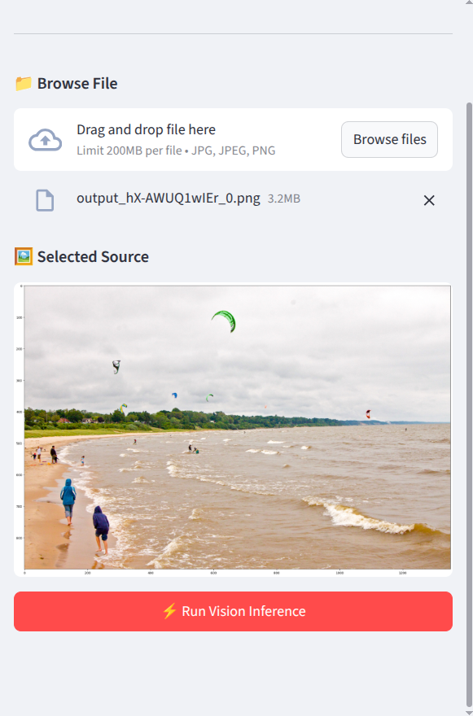
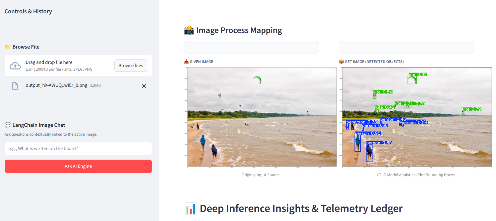
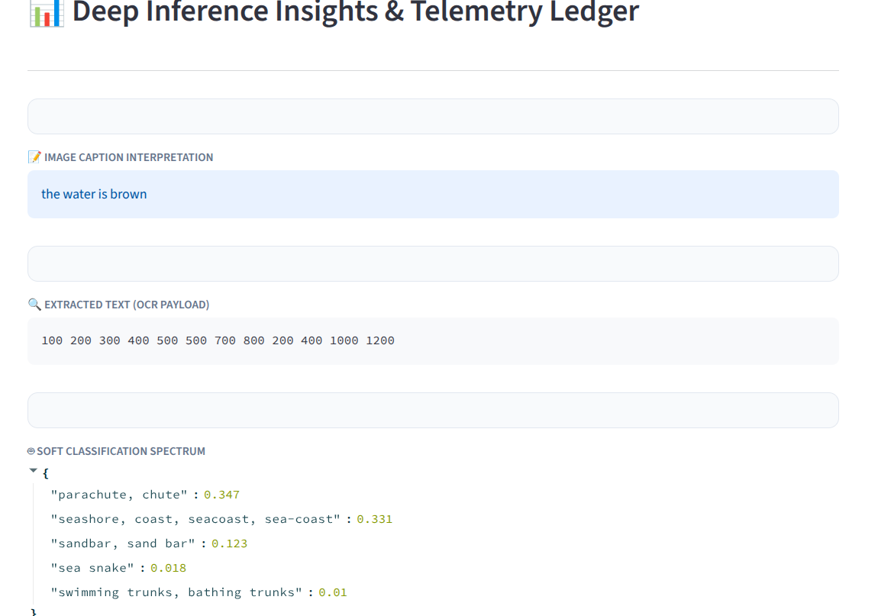
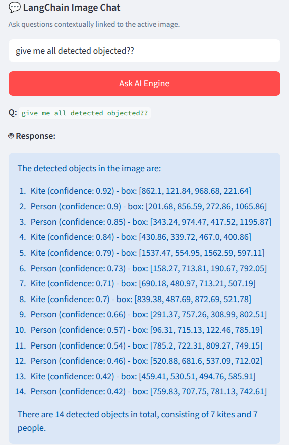

# 🖼️ Vision AI Assistant

<p align="center">
  
  
  
  
  
  
  
  
  
  
</p>

<p align="center">
An AI-powered image understanding system that combines <strong>Computer Vision</strong>, <strong>OCR</strong>, <strong>Image Captioning</strong>, and <strong>Large Language Models</strong> to let users have natural conversations with images.
</p>

---

# 🚀 Overview

Traditional image classification systems produce only a single prediction.

This project goes much further.

Instead of relying on one AI model, the uploaded image is analyzed simultaneously by multiple specialized vision models. The extracted visual information is stored inside a relational database, and an LLM uses that structured knowledge to answer natural language questions about the image.

Rather than asking:

> "What is this image?"

Users can ask:

- What objects are present?
- Is there any text?
- Describe the entire scene.
- What products are visible?
- Count the detected people.
- Summarize everything found in the image.

The application behaves like an AI assistant that can "see" the image and discuss it intelligently.

---

# ✨ Features

## 🖼️ Image Upload

## Project Banner

<p align="center">
  
</p>
## 📤 Upload an Image

<p align="center">
  
</p>
## 🎯 Object Detection

<p align="center">
  
</p>
## 🧠 AI Analysis

<p align="center">
  
</p>
## 💬 Chat with the Image

<p align="center">
  
</p>

---

## 🎯 Object Detection (YOLOv8)

Detects:

- People
- Vehicles
- Animals
- Electronics
- Furniture
- Everyday objects

Features

- Bounding boxes
- Confidence scores
- Annotated output images

---

## 🧠 Image Captioning (BLIP)

Generates human-like captions describing the entire scene.

Example

> "A person sitting at a desk using a laptop while drinking coffee."

---

## 🏷️ Image Classification (ViT)

Predicts the overall category of the image using Vision Transformers.

---

## 📝 OCR (EasyOCR)

Extracts visible text from:

- Documents
- Receipts
- Signboards
- Screenshots
- Product packaging

Supports multiple languages.

---

## 💾 Structured Metadata Storage

All AI outputs are converted into structured JSON and stored in the database.

Stored information includes:

- Object labels
- Bounding boxes
- Confidence scores
- OCR text
- Generated captions
- Image classifications

---

## 💬 Chat with Images (Multimodal RAG)

Users can ask questions such as:

> Is there any text in this image?

> What objects are detected?

> Summarize this image.

> Describe everything you found.

Instead of analyzing the image again, LangChain retrieves the stored metadata from the database and sends it to a local LLM (Llama 3 via Ollama), enabling intelligent conversations about the image.

---

# 🏗️ System Architecture

```text
                Upload Image
                      │
                      ▼
          Streamlit Frontend
                      │
                      ▼
             FastAPI Backend
                      │
       Background Processing
                      │
      ─────────────────────────────
      │            │             │
      ▼            ▼             ▼
   YOLOv8        BLIP          EasyOCR
(Object Detection)(Caption)   (OCR)
      │            │             │
      └────────────┼─────────────┘
                   ▼
          Vision Transformer
         (Image Classification)
                   │
                   ▼
          Structured JSON Output
                   │
                   ▼
              SQL Database
                   │
                   ▼
             LangChain RAG
                   │
                   ▼
           Ollama (Llama 3)
                   │
                   ▼
            Conversational AI
```

---

# 🛠️ Tech Stack

| Category | Technology |
|----------|------------|
| Language | Python 3.10 |
| Backend | FastAPI |
| Frontend | Streamlit |
| Object Detection | YOLOv8 |
| Image Captioning | BLIP |
| Image Classification | Vision Transformer (ViT) |
| OCR | EasyOCR |
| LLM Framework | LangChain |
|llm = ChatGroq(
        model_name="llama-3.3-70b-versatile",
        temperature=0.7
            )
    
| Database | SQLAlchemy |
| Image Processing | OpenCV, Pillow |
| Deep Learning | PyTorch |

---

# 📂 Project Structure

```text
.
├── backend
│
├── app
│   ├── database
│   │   ├── database.py
│   │   ├── models.py
│   │   └── schemas.py
│   │
│   ├── utils.py
│   ├── main.py
│   └── __init__.py
│
├── static
│   ├── uploads
│   └── annotated
│
├── yolov8m.pt
│
├── frontend
│   └── frontend.py
│
├── requirements.txt
│
└── README.md
```

---

# ⚙️ Installation

## Clone Repository

```bash
git clone https://github.com/yourusername/vision-ai-assistant.git

cd vision-ai-assistant
```

---

## Create Virtual Environment

Linux/macOS

```bash
python3.10 -m venv venv

source venv/bin/activate
```

Windows

```bash
python -m venv venv

venv\Scripts\activate
```

---

## Install Dependencies

```bash
pip install -r requirements.txt
```

---

# 📦 Requirements

```text
FastAPI
Uvicorn
Streamlit
PyTorch
Torchvision
Ultralytics (YOLOv8)
Transformers
EasyOCR
OpenCV
Pillow
SQLAlchemy
LangChain
langchainGroq(
        model_name="llama-3.3-70b-versatile")
    
Python-dotenv
Requests
```

---

# ▶️ Running the Backend

```bash
uvicorn app.main:app --reload
```

---

# 🖥️ Running the Frontend

```bash
streamlit run frontend/frontend.py
```

---

# 🔄 Processing Pipeline

## Step 1

User uploads an image through Streamlit.

↓

## Step 2

FastAPI immediately returns success while BackgroundTasks process the image asynchronously.

↓

## Step 3

Three AI models execute simultaneously.

- YOLOv8
- BLIP
- EasyOCR

↓

## Step 4

Vision Transformer classifies the image.

↓

## Step 5

All outputs are stored inside SQLAlchemy as structured metadata.

↓

## Step 6

User asks questions about the image.

↓

## Step 7

LangChain retrieves stored metadata.

↓

## Step 8

Ollama (Llama 3) generates intelligent responses.

---

# 💬 Example Questions

```
Describe this image.

How many people are visible?

Is there any text?

Read all the text.

What products do you see?

Summarize the image.

Is anyone using a laptop?

What color is the car?

List every detected object.
```

---

# 🚀 Engineering Highlights

### ✅ Asynchronous Processing

Heavy AI inference runs in FastAPI `BackgroundTasks`, ensuring the API remains responsive.

---

### ✅ Efficient Model Loading

Large AI models are initialized once during application startup using FastAPI lifespan events, reducing latency and avoiding repeated memory allocation.

---

### ✅ Multimodal AI Pipeline

Integrates multiple computer vision models into a unified inference pipeline for comprehensive image understanding.

---

### ✅ Structured AI Metadata

Instead of storing raw predictions, the application organizes AI outputs into structured JSON for efficient retrieval and reasoning.

---

### ✅ Multimodal Retrieval-Augmented Generation (RAG)

Visual information is transformed into textual context, allowing a local LLM to answer image-related questions without directly processing pixels.

---

### ✅ Scalable Architecture

Designed with separate frontend, backend, AI inference, and database layers for maintainability and future expansion.

---

# 📈 Future Improvements

- Face Recognition
- Image Similarity Search
- Vector Database Integration
- Semantic Image Search
- Video Understanding
- Multi-image Conversations
- Voice Question Answering
- Docker Support
- Kubernetes Deployment
- Authentication & User Management
- REST API Documentation with Swagger
- Cloud Storage Integration

---

# 🤝 Contributing

Contributions are welcome!

Feel free to:

- Fork the repository
- Create a new branch
- Submit a Pull Request

---

# 📄 License

This project is licensed under the **MIT License**.

---

# 👨‍💻 Author

**Rifat Sarker**

AI Engineer | Machine Learning | Computer Vision | NLP | LangChain | FastAPI

⭐ If you found this project helpful, consider giving it a star on GitHub.
